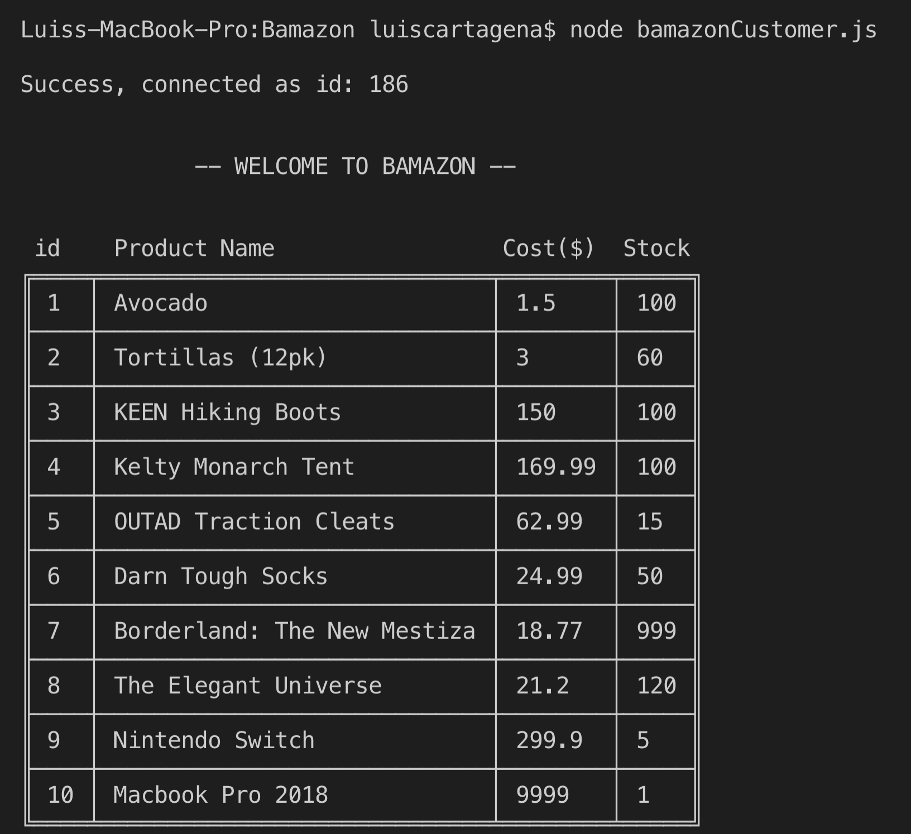
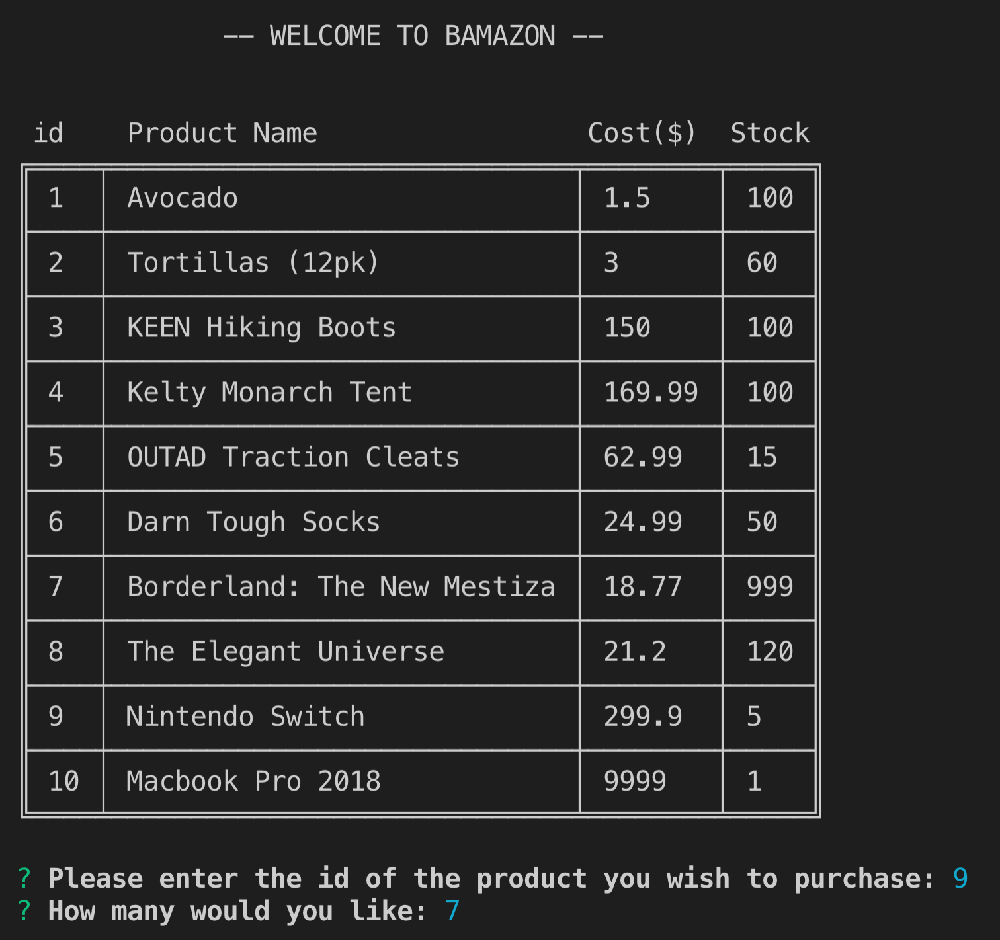
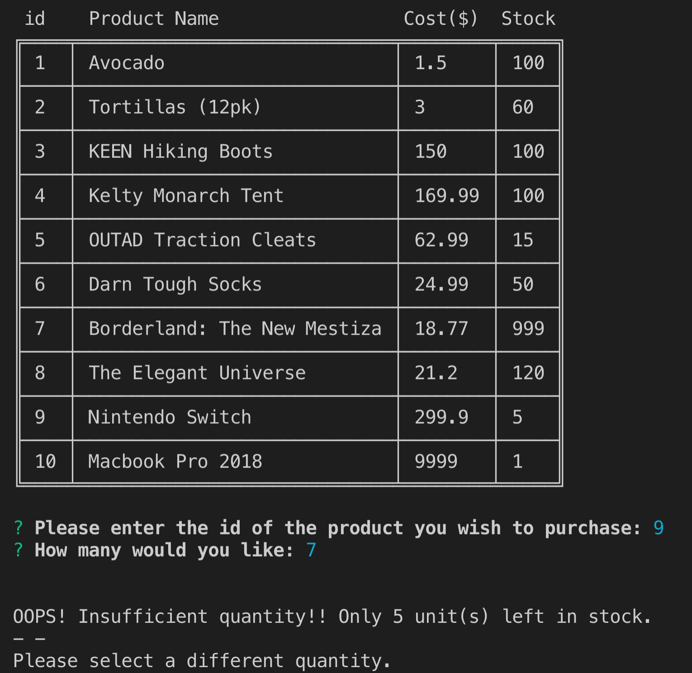
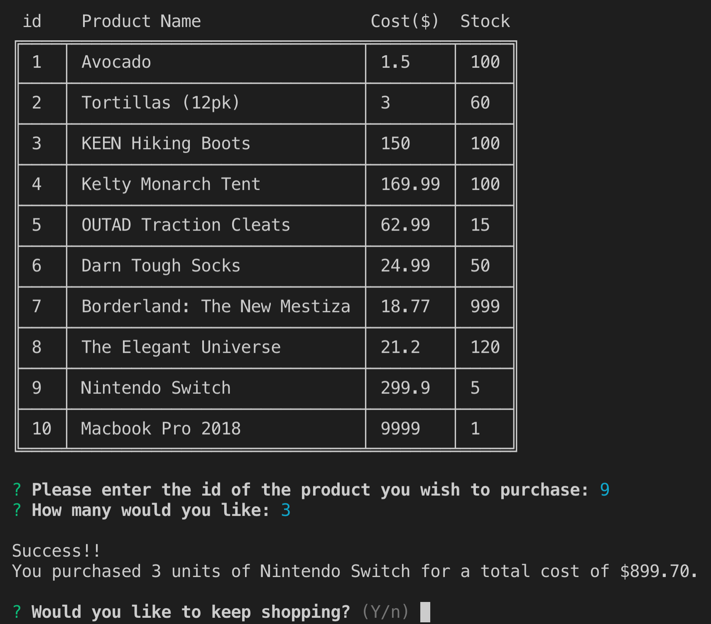
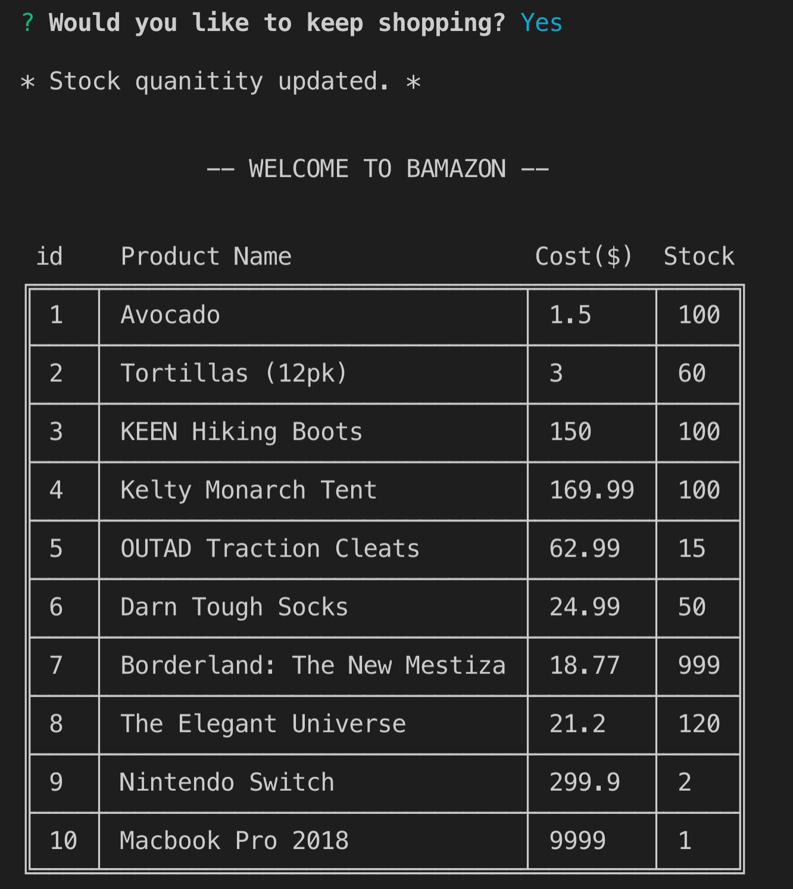

# Bamazon

# Node.js & MySQL

## Overview

Bamazon is an Amazon-like storefront that takes in orders from customers and depletes stock from the store's inventory. The app is built with node.js and MySQL.

## Instructions

### Customer

1. Running this application (i.e., in the the command line or terminal: node bamazonCustomer.js) will first display all of the items available for sale, along with their ids, names, prices, and stock quantity for sale.

2. The app then prompts users with two messages.

   * The first asks for the ID of the product they would like to buy.
   * The second message asks how many units of the product they would like to buy.

3. Once the customer has placed the order, the application checks if the store has enough of the product to meet the customer's request.

   * If not, the app will log the phrase `Insufficient quantity!`, and then prevent the order from going through.

4. However, if the store _does_ have enough of the product, it will fulfill the customer's order.
   * This means updating the SQL database to reflect the remaining quantity.
   * Once the update goes through, the customer's total cost of their purchase will be displayed.

- - -